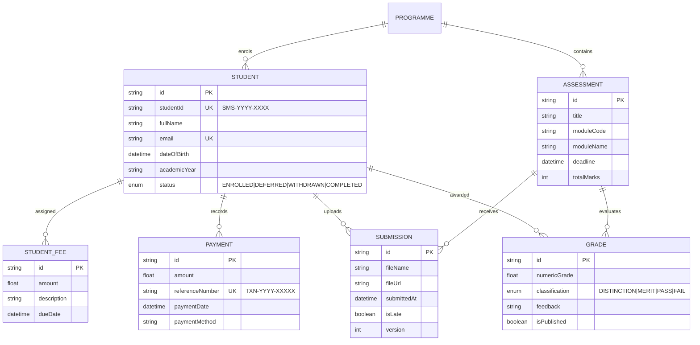

# RegistryOS — Project Architecture & Technical Details

## Executive Overview

**RegistryOS** is an enterprise-grade Registry Module of a Higher Education Student Management System built for **PEN Global (PEN Group)**. It is engineered to support the daily operational responsibilities of academic administrators and registrars across four essential workflows: **Student Enrolment**, **Fees & Financial Ledgers**, **Coursework Assessment Management**, and **Examination Board Marksheet Publication**.

The platform is designed around strict data integrity, real-time balance calculations, role separation (Staff vs. Student portals), and edge-case handling.

---

## 1. System Architecture & Tech Stack

```
┌─────────────────────────────────────────────────────────────┐
│                 Client Layer (Browser)                      │
│   Next.js 16 (App Router) • React 19 • Tailwind CSS        │
│   Glassmorphism UI • Lucide Icons • Plus Jakarta Sans Font  │
└──────────────────────────────┬──────────────────────────────┘
                               │ HTTP / JSON / Multipart
┌──────────────────────────────▼──────────────────────────────┐
│             Server & API Layer (Next.js 16)                 │
│   Route Handlers (/api/students, /api/fees, etc.)           │
│   Business Logic (Grading, Late Detection, Balances)        │
└──────────────────────────────┬──────────────────────────────┘
                               │ Prisma Client 7 (Pool)
┌──────────────────────────────▼──────────────────────────────┐
│                    Data Persistence                         │
│   PostgreSQL 18 Database Engine                             │
│   Prisma ORM with pg-adapter connection pool                │
└─────────────────────────────────────────────────────────────┘
```

### Technology Matrix

| Layer | Technology | Details |
|---|---|---|
| **Framework** | **Next.js 16 (App Router)** | Full-stack architecture with server-rendered layouts and client components. |
| **Language** | **TypeScript 5.9** | Strict type safety across Prisma models, API payloads, and UI props. |
| **Database** | **PostgreSQL 18** | Relational database with transactions, cascade constraints, and unique compound keys. |
| **ORM** | **Prisma 7.10** | Prisma ORM with `@prisma/adapter-pg` connection pool. |
| **Styling** | **Tailwind CSS + Glassmorphism** | Bespoke UI design system with dark sapphire tones, neon accents, and responsive layout. |
| **Icons & Typography** | **Lucide React + Plus Jakarta Sans** | Modern iconset and typography. |

---

## 2. Database Design & Relational Schema

The database model is defined in `prisma/schema.prisma`. It mirrors how higher education registries manage academic programs, student lifecycles, and financial accounts:



### Relational Integrity Highlights
1. **Unique Student ID**: Formatted as `SMS-YYYY-XXXX` (e.g. `SMS-2025-0001`). Indexed and constrained uniquely at the database level.
2. **One Submission Per Student Per Assessment**: Guaranteed through Prisma compound unique constraint `@@unique([studentId, assessmentId])`. When a student resubmits before the deadline, the record is updated in place, incrementing `version`.
3. **One Grade Per Student Per Assessment**: Enforced via `@@unique([studentId, assessmentId])`, enabling grade entry and updates without duplicate records.
4. **Cascade Deletions**: Deleting a student record cleans up associated payments, fees, submissions, and grades, while protecting Programme reference integrity (`onDelete: Restrict`).

---

## 3. Deep Dive into the 4 Core Workflows

### Workflow 1: Student Enrolment
- **Automatic ID Generation**: On every enrolment, the system executes `generateNextStudentId()`. It queries the highest sequence number for the current academic year, increments it by 1, and zero-pads it to 4 digits (e.g. `SMS-2025-0001` -> `SMS-2025-0002`).
- **Required Fields**: Full Name, Email (verified unique), Date of Birth, Academic Year, and Enrolment Status (`ENROLLED`, `DEFERRED`, `WITHDRAWN`, `COMPLETED`).
- **Automatic Fee Assignment**: Upon creation, the student's ledger is automatically initialized with an entry matching the selected programme's `standardFee`, set with a default due date 30 days from enrolment.
- **Search & Multi-Filtering**: Live filtering by partial name, Student ID, email, programme department, enrolment status, or overdue payment flag.

### Workflow 2: Fees & Payments
- **Programme Fee Assignment**: Each programme defines a baseline standard tuition fee (e.g. £9,250 for BSc Computer Science; £14,000 for MBA).
- **Payment Transaction Logging**: Registry administrators record payments with transaction amount, settlement date, unique reference number (`TXN-YYYY-XXXXX`), payment method (Bank Transfer, Debit Card, Credit Card, Cheque, Sponsor Wire), and internal notes.
- **Real-Time Balance Calculation**:
  $$\text{Outstanding Balance} = \sum(\text{Student Fees}) - \sum(\text{Student Payments})$$
  Balances update dynamically on every transaction without static caching.
- **Overdue Visual Triage (Edge Case)**: Any student with a positive balance where `fee.dueDate < new Date()` is visually flagged across the Registry Dashboard and student lists with an animated `OVERDUE` badge.

### Workflow 3: Assessment Submission
- **Staff Assessment Management**: Staff configure assessments specifying title, module code, module name, total marks, and deadline timestamp.
- **Strict File Type Enforcement**: Student file uploads are restricted to `.pdf`, `.docx`, and `.doc`. Non-compliant files are rejected with informative validation messages.
- **Single Submission & Resubmission Rule**:
  - A student can submit one deliverable per assessment.
  - Prior to the deadline, students can resubmit their file; the existing submission record is updated, the file is replaced, and the `version` counter increments (e.g. `v1` $\rightarrow$ `v2`).
- **Late Submission Handling (Edge Case)**: If an initial submission occurs after the deadline has passed, the system accepts the file to preserve student work, but marks `isLate: true` and flags it with a high-visibility badge in the staff UI. Resubmissions after the deadline has passed are rejected.

### Workflow 4: Marksheet & Results
- **Numeric Grading**: Staff enter a score from `0.0` to `100.0` with qualitative feedback.
- **UK University Classification System**:
  - **Distinction**: Grade $\ge 70\%$
  - **Merit**: Grade $\ge 60\%$ and $< 70\%$
  - **Pass**: Grade $\ge 40\%$ and $< 60\%$
  - **Fail**: Grade $< 40\%$ (resit required)
- **Result Publication & Privacy Control (Edge Case)**: Staff control visibility per-student via `isPublished`. Students can only view results that have been published. Unreleased or withheld results display an Examination Board moderation notice.

---

## 4. Role Separation & UX Design

The interface features an instant role toggle between **Staff View** and **Student View**:

1. **Staff (Registry Administrator) View**:
   - Executive Dashboard with KPI cards, fee collection progress, and overdue student triage.
   - Full student enrolment directory and dossier inspector.
   - Financial ledger with payment posting modal.
   - Assessment manager with file submission downloads.
   - Examination Board marksheet entry and publication switches.

2. **Student Self-Service Portal**:
   - Simulated Persona Selector allowing testing across multiple student profiles (e.g. Amina Rahman, Liam O'Connor, Elena Rostova, David Chen).
   - Digital student identity card header.
   - Coursework submission tab with upload dropzone and deadline tracking.
   - Official certified marksheet displaying only published results.
   - Personal tuition ledger and receipt history.

---

## 5. Summary of Edge Cases Handled

| Edge Case | Implementation & Resolution |
|---|---|
| **Overdue Fees** | Filtered and flagged with animated `OVERDUE` badges on the Executive Dashboard and student tables; "Overdue Only" filter toggle provided. |
| **Late Coursework Uploads** | Accepted after deadline to avoid data loss, but permanently flagged with `isLate: true` and a high-visibility warning in the staff interface. |
| **Resubmission Deadline Enforcement** | Resubmissions are permitted before deadline; blocked with HTTP `403 Forbidden` if attempted after deadline passes. |
| **Results Privacy & Withholding** | Withheld grades are filtered out of student queries (`publishedOnly=true`); student portal displays an Examination Board moderation notice instead of leaking unconfirmed marks. |
| **Duplicate Transaction IDs** | Auto-generated reference numbers (`TXN-YYYY-XXXXX`) checked against PostgreSQL unique constraints to prevent double-posting. |
| **Next.js Fast-Refresh Connection Leaks** | Database connection pooling configured in `src/lib/prisma.ts` with idle timeouts and `globalThis` caching to prevent pool exhaustion in development. |
